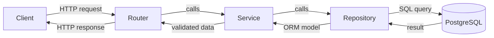
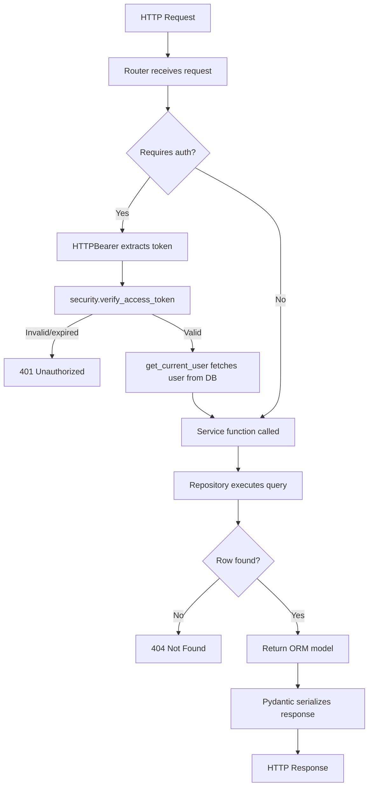

# Architecture

## Layer Overview

Every resource (users, movies, actors, auth) follows a strict four-layer pattern:



| Layer | Location | Responsibility |
|---|---|---|
| Router | `src/routers/` | Receive and validate HTTP requests; inject dependencies; return responses |
| Service | `src/services/` | Business logic; raise `HTTPException` for domain errors |
| Repository | `src/repositories/` | Raw SQLAlchemy queries; no HTTP concerns |
| Schema | `src/schemas/` | Pydantic models for request/response serialization |
| Model | `src/models/` | SQLAlchemy ORM table definitions |

### Why this separation?

Services call repositories directly rather than issuing queries inline, keeping HTTP concerns out of the data layer. This also makes it straightforward to test services in isolation by injecting a different session.

## Request Lifecycle



## Core Modules

### `src/core/database.py`

Creates the async SQLAlchemy engine and session factory. Exposes `get_session`, a FastAPI dependency that yields an `AsyncSession` and commits/rolls back automatically.

Tests override `get_session` via `app.dependency_overrides` to inject an in-memory SQLite session, so no PostgreSQL instance is required at test time.

### `src/core/settings.py`

Reads configuration from `.env` using `pydantic-settings`. All settings are typed and validated at startup — the app fails fast if a required variable is missing. Exposes a computed `DATABASE_URL` property that assembles the `postgresql+psycopg://` connection string.

### `src/core/security.py`

Two responsibilities: password hashing and JWT operations. Uses `pwdlib[argon2]` for hashing with `PasswordHash.recommended()`, which automatically picks the best available Argon2 parameters. JWT encode/decode uses `PyJWT`; token expiry and algorithm come from settings.

### `src/core/constants.py`

Shared error message strings used by services. Centralizes strings like `USER_NOT_FOUND` and `FORBIDDEN` to avoid duplication across service files.

## Schemas

`src/schemas/common.py` defines three annotated type aliases used across all schemas:

```python
Age  = Annotated[int,   Field(gt=1, lt=150)]
Name = Annotated[str,   Field(min_length=2)]
Rating = Annotated[float, Field(gt=0, le=10)]
```

Reusing these aliases instead of repeating `Field(...)` constraints ensures consistent validation rules across all resources.

## Entrypoint

`app.py` creates the `FastAPI` instance and mounts four routers:

| Prefix | Router |
|---|---|
| `/api/v1/auth` | `src/routers/auth.py` |
| `/api/v1/users` | `src/routers/users.py` |
| `/api/v1/movies` | `src/routers/movies.py` |
| `/api/v1/actors` | `src/routers/actors.py` |

A standalone `GET /health` endpoint is defined directly in `app.py` and is not versioned.
