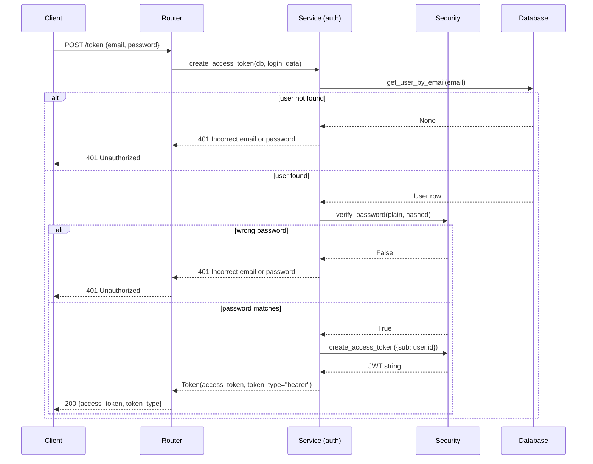
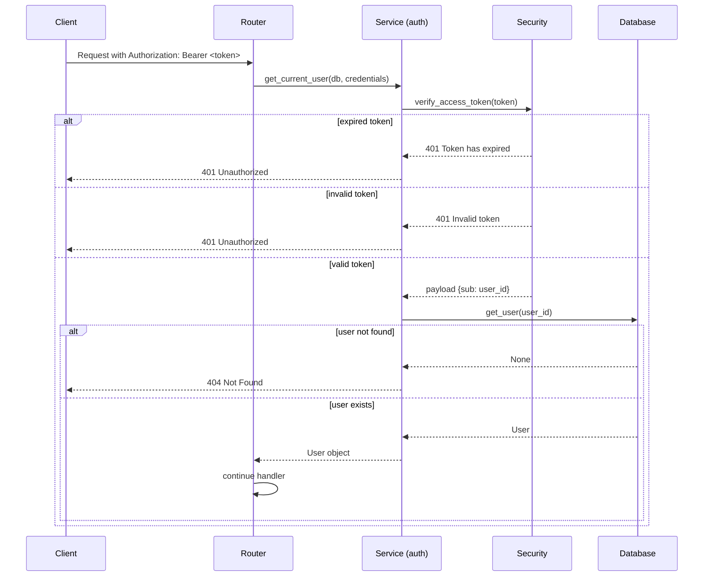
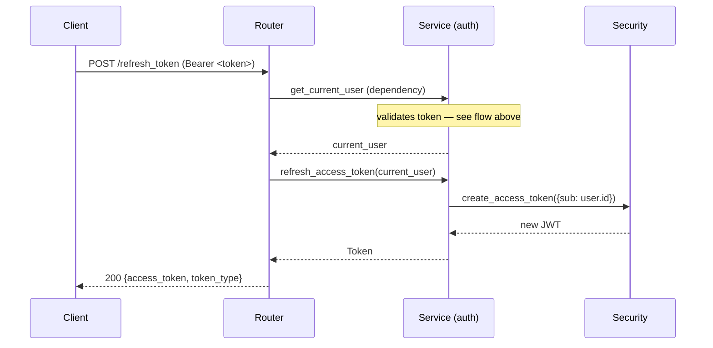

# Authentication

The API uses **JWT Bearer tokens** (HS256). Tokens are stateless — the server does not store sessions.

## Endpoints

| Method | Path | Auth required |
|---|---|---|
| `POST` | `/api/v1/auth/token` | No |
| `POST` | `/api/v1/auth/refresh_token` | Yes (valid token) |

## Login flow



## Using the token

Include the token in the `Authorization` header for protected endpoints:

```
Authorization: Bearer <access_token>
```

## Token verification flow

Every protected route uses `get_current_user` as a FastAPI dependency:



## Token refresh

Refreshing issues a new token without re-entering credentials. The current token must be valid (not expired):



> **Design note:** `refresh_access_token` requires a valid (non-expired) token. There is no long-lived refresh token; the client must refresh before the 15-minute window closes or re-authenticate.

## Ownership check

`PUT` and `DELETE` on `/api/v1/users/{id}` also call `verify_user_ownership`, which raises `403 Forbidden` if `current_user.id != user_id`. This prevents a logged-in user from modifying another user's account.

The same check applies to rating endpoints — only the authenticated user can create or update their own rating.

## Token configuration

| Setting | Default | Description |
|---|---|---|
| `JWT_SECRET_KEY` | — (required) | HMAC signing secret |
| `JWT_ALGORITHM` | `HS256` | Signing algorithm |
| `JWT_ACCESS_TOKEN_EXPIRE_MINUTES` | `15` | Token lifetime |

See [Getting Started](getting-started.md) for how to set these variables.
