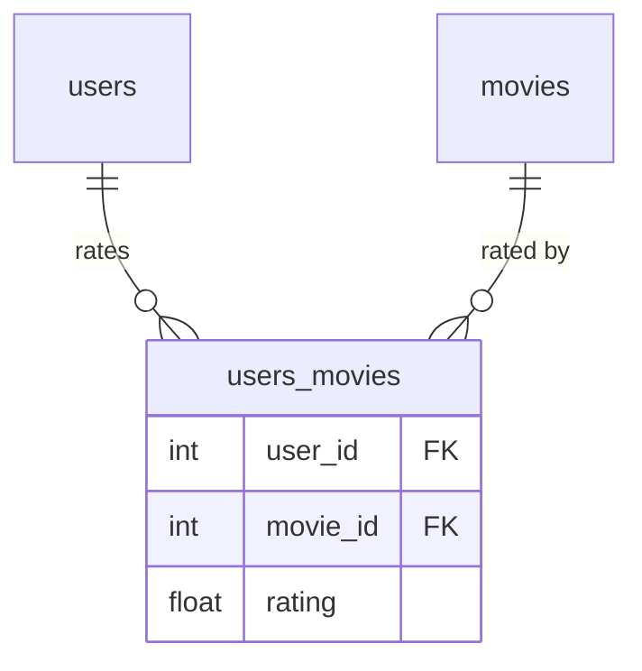
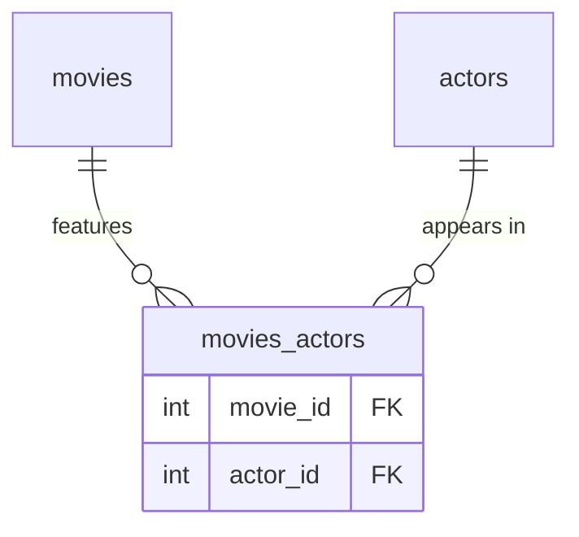

# Database

The schema has five tables. See [Architecture](architecture.md) for how the ORM models map to the layer structure.

## Tables

### `users`

| Column | Type | Constraints |
|---|---|---|
| `id` | integer | PK, auto-increment |
| `name` | string | NOT NULL |
| `email` | string | UNIQUE, NOT NULL |
| `age` | integer | NOT NULL |
| `password` | string | NOT NULL (argon2 hash) |
| `created_at` | datetime | server default `now()` |
| `updated_at` | datetime | server default `now()`, on update `now()` |

Password is stored as an Argon2 hash. It is never exposed in API responses — `UserDetailSchema` omits the `password` field entirely.

### `movies`

| Column | Type | Constraints |
|---|---|---|
| `id` | integer | PK, auto-increment |
| `name` | varchar(100) | UNIQUE, NOT NULL |
| `synopsis` | text | nullable |
| `director` | varchar(100) | NOT NULL |
| `release_date` | date | NOT NULL |
| `created_at` | datetime | server default `now()` |
| `updated_at` | datetime | server default `now()`, on update `now()` |

### `actors`

| Column | Type | Constraints |
|---|---|---|
| `id` | integer | PK, auto-increment |
| `name` | varchar(100) | UNIQUE, NOT NULL |
| `age` | integer | NOT NULL |
| `created_at` | datetime | server default `now()` |
| `updated_at` | datetime | server default `now()`, on update `now()` |

### `users_movies`

Junction table between `users` and `movies`. Carries an extra `rating` column — the reason it is a full ORM model (`UserMovie`) rather than a plain `Table` association.

| Column | Type | Constraints |
|---|---|---|
| `user_id` | integer | PK, FK → `users.id` ON DELETE CASCADE |
| `movie_id` | integer | PK, FK → `movies.id` ON DELETE CASCADE |
| `rating` | float | nullable |
| `created_at` | datetime | server default `now()` |
| `updated_at` | datetime | server default `now()`, on update `now()` |

`rating` is nullable because a user can have a movie on their list without having rated it yet.

### `movies_actors`

Pure junction table — no extra payload columns.

| Column | Type | Constraints |
|---|---|---|
| `movie_id` | integer | PK, FK → `movies.id` ON DELETE CASCADE |
| `actor_id` | integer | PK, FK → `actors.id` ON DELETE CASCADE |
| `created_at` | datetime | server default `now()` |
| `updated_at` | datetime | server default `now()` |

## Relationships

### User ↔ Movie (many-to-many with payload)



`User.user_movies` and `Movie.user_movies` are the ORM-level associations. The `User.movies` and `Movie.users` relationships are `viewonly=True` shortcuts that bypass `users_movies` for read-only access.

Because `users_movies` has the `rating` column, creating or updating a rating requires touching `UserMovie` directly — a plain M2M association table would not allow per-row data.

### Movie ↔ Actor (many-to-many, pure)



`Movie.actors` and `Actor.movies` are `viewonly=True` relationships through `movies_actors`.

## Cascade behavior

All foreign keys use `ON DELETE CASCADE` at the database level. At the ORM level, `User.user_movies` and `Movie.user_movies` are configured with `cascade="all, delete-orphan"`, which means:

- Deleting a `User` also deletes all their `users_movies` rows.
- Deleting a `Movie` also deletes all its `users_movies` and `movies_actors` rows.

`Actor.movies_actors` does **not** have `delete-orphan` cascade — deleting an actor removes only the junction rows, not the movies themselves.

## Migrations

Migrations are managed with Alembic. Migration files live in `migrations/versions/`. To apply all pending migrations:

```bash
uv run alembic upgrade head
```

To create a new migration after changing a model:

```bash
uv run alembic revision --autogenerate -m "describe change"
```
