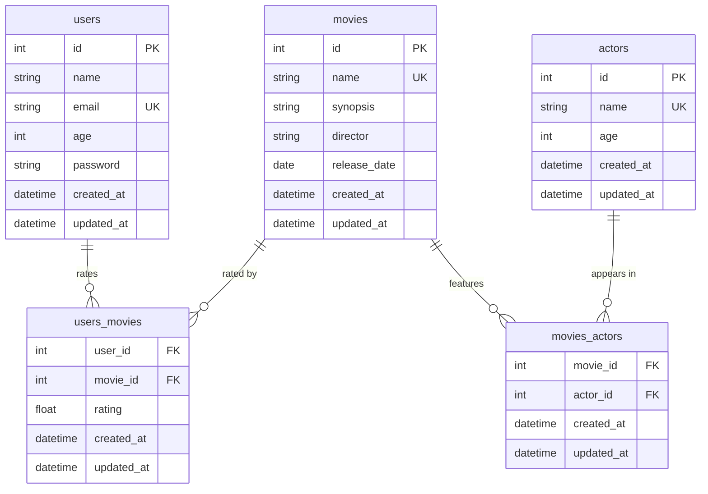

# Movie Rating API

A REST API for rating movies, built with **FastAPI** and **async SQLAlchemy**.

## Tech stack

| Layer | Technology |
|---|---|
| Web framework | [FastAPI](https://fastapi.tiangolo.com/) |
| ORM | SQLAlchemy 2.x (async) |
| Database | PostgreSQL (production) / SQLite in-memory (tests) |
| Migrations | Alembic |
| Settings | pydantic-settings |
| Password hashing | pwdlib[argon2] |
| Authentication | PyJWT (HS256) |
| Validation | Pydantic v2 |

## Data model

The diagram below shows all five database tables and their relationships.

## Explore the docs

- [Getting Started](getting-started.md) — run the project locally
- [Architecture](architecture.md) — layers, request lifecycle, and core modules
- [Authentication](authentication.md) — JWT flow and token usage
- [Database](database.md) — tables, constraints, and cascade rules
- [API Reference](api-reference.md) — all endpoints with request/response details
