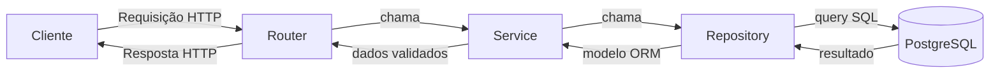
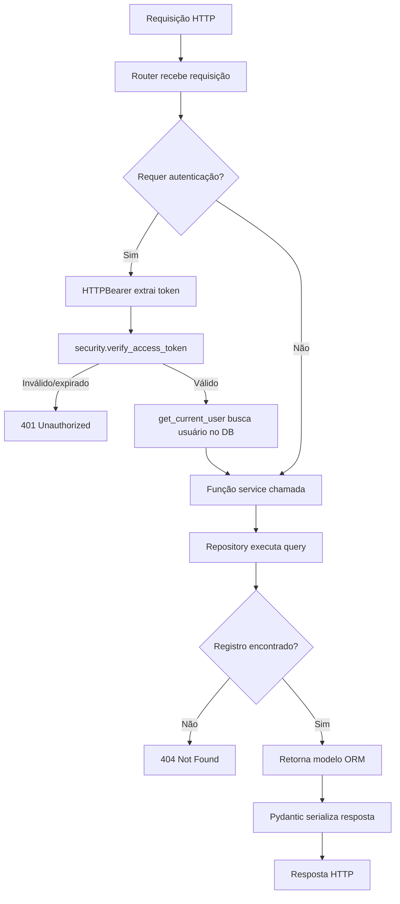

# Arquitetura

## Visão geral das camadas

Cada recurso (users, movies, actors, auth) segue um padrão estrito de quatro camadas:



| Camada | Localização | Responsabilidade |
|---|---|---|
| Router | `src/routers/` | Receber e validar requisições HTTP; injetar dependências; retornar respostas |
| Service | `src/services/` | Lógica de negócio; lança `HTTPException` para erros de domínio |
| Repository | `src/repositories/` | Queries SQLAlchemy puras; sem preocupações HTTP |
| Schema | `src/schemas/` | Modelos Pydantic para serialização de request/response |
| Model | `src/models/` | Definições de tabelas ORM SQLAlchemy |

### Por que essa separação?

Services chamam repositories diretamente em vez de executar queries inline, mantendo preocupações HTTP fora da camada de dados. Isso também facilita testar services de forma isolada injetando uma sessão diferente.

## Ciclo de vida de uma requisição



## Módulos core

### `src/core/database.py`

Cria a engine SQLAlchemy assíncrona e a fábrica de sessões. Expõe `get_session`, uma dependência FastAPI que produz um `AsyncSession` e faz commit/rollback automaticamente.

Os testes sobrescrevem `get_session` via `app.dependency_overrides` para injetar uma sessão SQLite em memória, dispensando uma instância PostgreSQL em tempo de teste.

### `src/core/settings.py`

Lê a configuração do `.env` usando `pydantic-settings`. Todas as configurações são tipadas e validadas na inicialização — a aplicação falha rapidamente se uma variável obrigatória estiver faltando. Expõe uma propriedade computada `DATABASE_URL` que monta a string de conexão `postgresql+psycopg://`.

### `src/core/security.py`

Duas responsabilidades: hash de senha e operações JWT. Usa `pwdlib[argon2]` para hash com `PasswordHash.recommended()`, que escolhe automaticamente os melhores parâmetros Argon2 disponíveis. Encode/decode JWT usa `PyJWT`; expiração e algoritmo vêm das settings.

### `src/core/constants.py`

Strings de mensagens de erro compartilhadas usadas pelos services. Centraliza strings como `USER_NOT_FOUND` e `FORBIDDEN` para evitar duplicação nos arquivos de service.

## Schemas

`src/schemas/common.py` define três aliases de tipo anotados usados em todos os schemas:

```python
Age    = Annotated[int,   Field(gt=1, lt=150)]
Name   = Annotated[str,   Field(min_length=2)]
Rating = Annotated[float, Field(gt=0, le=10)]
```

Reutilizar esses aliases em vez de repetir restrições `Field(...)` garante regras de validação consistentes em todos os recursos.

## Entrypoint

`app.py` cria a instância `FastAPI` e monta quatro routers:

| Prefixo | Router |
|---|---|
| `/api/v1/auth` | `src/routers/auth.py` |
| `/api/v1/users` | `src/routers/users.py` |
| `/api/v1/movies` | `src/routers/movies.py` |
| `/api/v1/actors` | `src/routers/actors.py` |

Um endpoint independente `GET /health` é definido diretamente em `app.py` e não possui versionamento.
