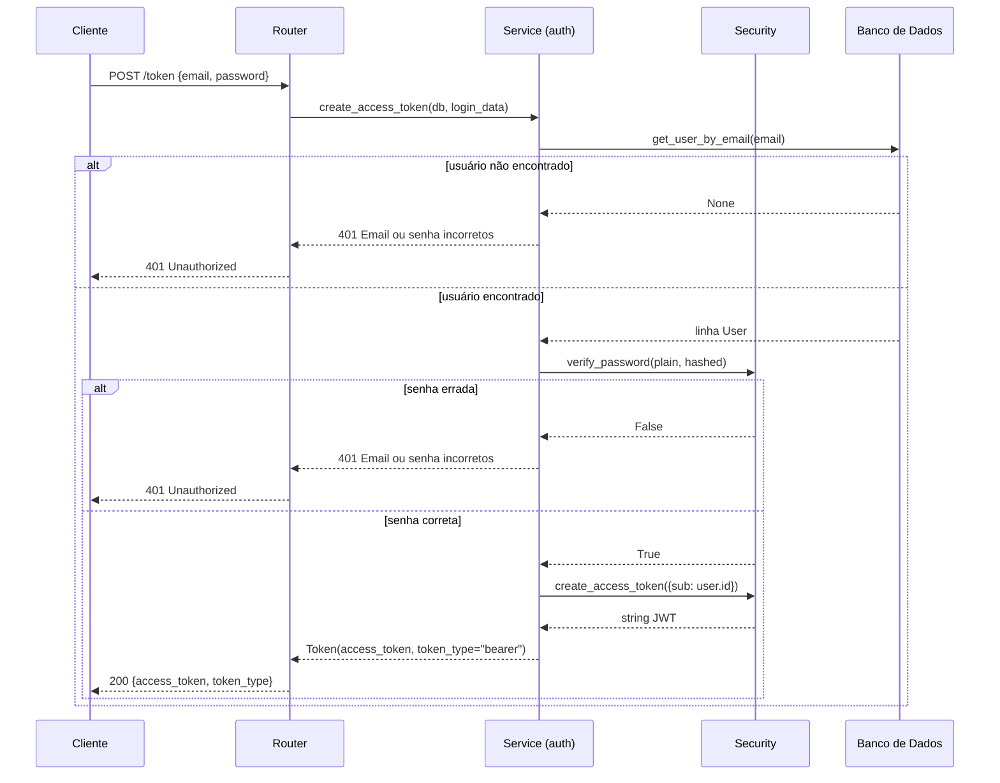
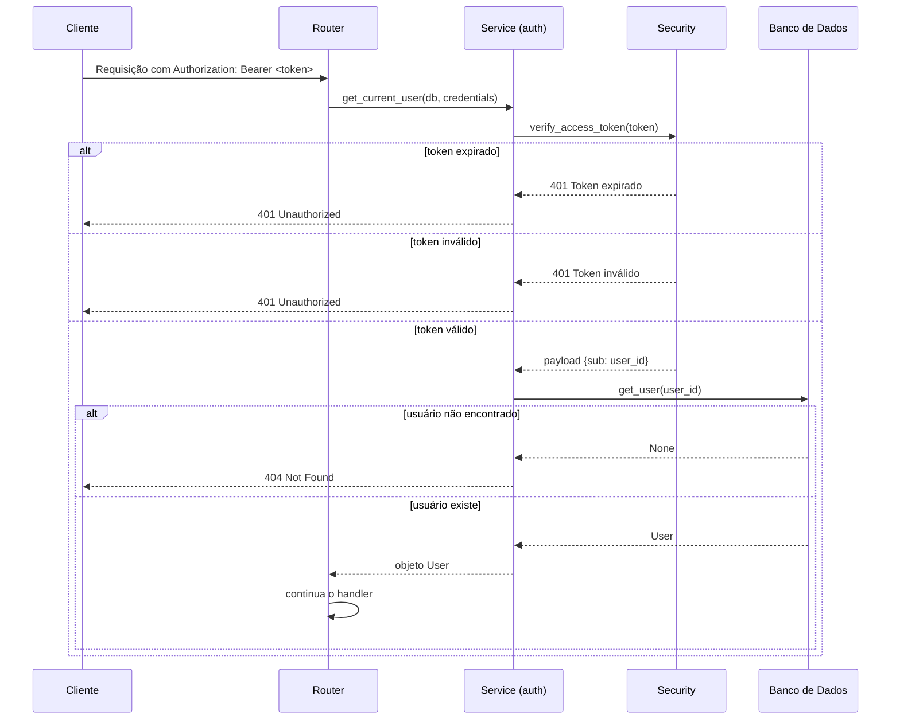
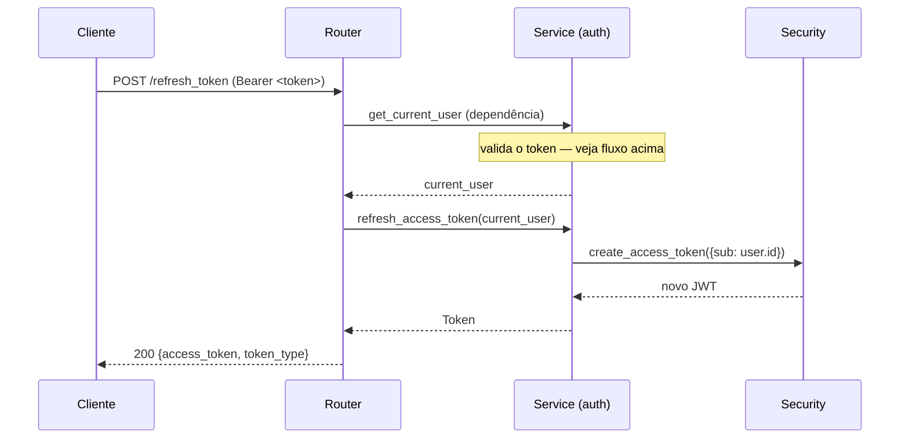

# Autenticação

A API usa **tokens JWT Bearer** (HS256). Os tokens são stateless — o servidor não armazena sessões.

## Endpoints

| Método | Path | Autenticação |
|---|---|---|
| `POST` | `/api/v1/auth/token` | Não |
| `POST` | `/api/v1/auth/refresh_token` | Sim (token válido) |

## Fluxo de login



## Usando o token

Inclua o token no header `Authorization` para endpoints protegidos:

```
Authorization: Bearer <access_token>
```

## Fluxo de verificação do token

Todo route protegido usa `get_current_user` como dependência FastAPI:



## Refresh de token

O refresh emite um novo token sem precisar reenviar credenciais. O token atual deve ser válido (não expirado):



> **Decisão de design:** `refresh_access_token` exige um token válido (não expirado). Não existe um refresh token de longa duração; o cliente deve renovar antes que a janela de 15 minutos feche ou re-autenticar.

## Verificação de usuário dono de recurso

`PUT` e `DELETE` em `/api/v1/users/{id}` também chamam `verify_user_ownership`, que lança `403 Forbidden` se `current_user.id != user_id`. Isso impede que um usuário autenticado modifique a conta de outro usuário.

O mesmo vale para os endpoints de avaliação — apenas o usuário autenticado pode criar ou atualizar sua própria avaliação.

## Configuração do token

| Variável | Padrão | Descrição |
|---|---|---|
| `JWT_SECRET_KEY` | — (obrigatória) | Segredo HMAC para assinatura |
| `JWT_ALGORITHM` | `HS256` | Algoritmo de assinatura |
| `JWT_ACCESS_TOKEN_EXPIRE_MINUTES` | `15` | Tempo de vida do token |

Veja [Primeiros Passos](getting-started.md) para configurar essas variáveis.
