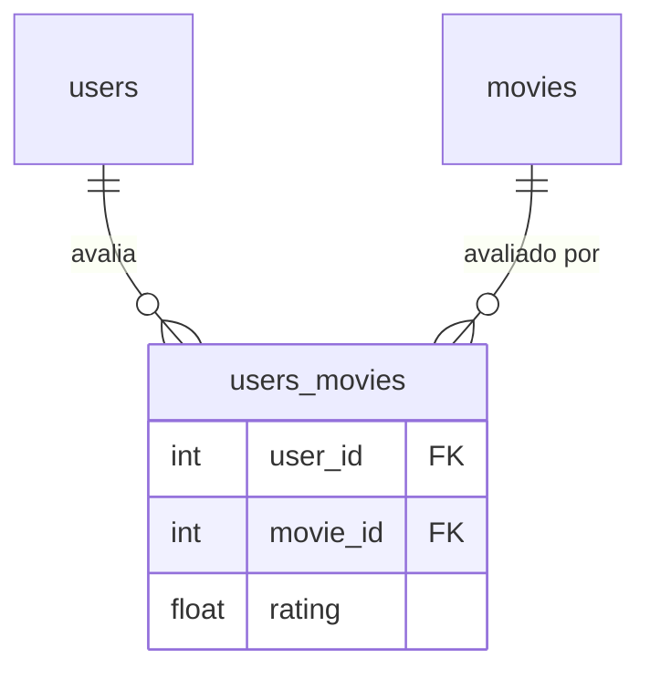
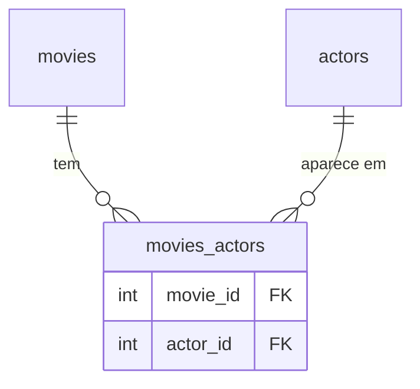

# Banco de Dados

O schema possui cinco tabelas. Veja [Arquitetura](architecture.md) para entender como os modelos ORM se mapeiam na estrutura de camadas.

## Tabelas

### `users`

| Coluna | Tipo | Constraints |
|---|---|---|
| `id` | inteiro | PK, auto-incremento |
| `name` | string | NOT NULL |
| `email` | string | UNIQUE, NOT NULL |
| `age` | inteiro | NOT NULL |
| `password` | string | NOT NULL (hash argon2) |
| `created_at` | datetime | server default `now()` |
| `updated_at` | datetime | server default `now()`, on update `now()` |

A senha é armazenada como hash Argon2. Ela nunca é exposta nas respostas da API — `UserDetailSchema` omite o campo `password` completamente.

### `movies`

| Coluna | Tipo | Constraints |
|---|---|---|
| `id` | inteiro | PK, auto-incremento |
| `name` | varchar(100) | UNIQUE, NOT NULL |
| `synopsis` | text | nullable |
| `director` | varchar(100) | NOT NULL |
| `release_date` | date | NOT NULL |
| `created_at` | datetime | server default `now()` |
| `updated_at` | datetime | server default `now()`, on update `now()` |

### `actors`

| Coluna | Tipo | Constraints |
|---|---|---|
| `id` | inteiro | PK, auto-incremento |
| `name` | varchar(100) | UNIQUE, NOT NULL |
| `age` | inteiro | NOT NULL |
| `created_at` | datetime | server default `now()` |
| `updated_at` | datetime | server default `now()`, on update `now()` |

### `users_movies`

Tabela de junção entre `users` e `movies`. Possui uma coluna extra `rating` — a razão pela qual é um modelo ORM completo (`UserMovie`) em vez de uma associação `Table` simples.

| Coluna | Tipo | Constraints |
|---|---|---|
| `user_id` | inteiro | PK, FK → `users.id` ON DELETE CASCADE |
| `movie_id` | inteiro | PK, FK → `movies.id` ON DELETE CASCADE |
| `rating` | float | nullable |
| `created_at` | datetime | server default `now()` |
| `updated_at` | datetime | server default `now()`, on update `now()` |

`rating` é nullable porque um usuário pode ter um filme na lista sem ainda ter avaliado.

### `movies_actors`

Tabela de junção pura — sem colunas de payload extras.

| Coluna | Tipo | Constraints |
|---|---|---|
| `movie_id` | inteiro | PK, FK → `movies.id` ON DELETE CASCADE |
| `actor_id` | inteiro | PK, FK → `actors.id` ON DELETE CASCADE |
| `created_at` | datetime | server default `now()` |
| `updated_at` | datetime | server default `now()` |

## Relacionamentos

### User ↔ Movie (many-to-many com payload)



`User.user_movies` e `Movie.user_movies` são as associações no nível ORM. Os relacionamentos `User.movies` e `Movie.users` são atalhos `viewonly=True` que ignoram `users_movies` para acesso somente-leitura.

Como `users_movies` tem a coluna `rating`, criar ou atualizar uma avaliação exige manipular `UserMovie` diretamente — uma tabela de associação M2M simples não permitiria dados por linha.

### Movie ↔ Actor (many-to-many, pura)



`Movie.actors` e `Actor.movies` são relacionamentos `viewonly=True` através de `movies_actors`.

## Comportamento de cascade

Todas as chaves estrangeiras usam `ON DELETE CASCADE` no nível do banco. No nível ORM, `User.user_movies` e `Movie.user_movies` são configurados com `cascade="all, delete-orphan"`, o que significa:

- Deletar um `User` também deleta todas as suas linhas em `users_movies`.
- Deletar um `Movie` também deleta todas as suas linhas em `users_movies` e `movies_actors`.

`Actor.movies_actors` **não** possui cascade `delete-orphan` — deletar um ator remove apenas as linhas de junção, não os filmes.

## Migrações

As migrações são gerenciadas com Alembic. Os arquivos ficam em `migrations/versions/`. Para aplicar todas as migrações pendentes:

```bash
uv run alembic upgrade head
```

Para criar uma nova migração após alterar um modelo:

```bash
uv run alembic revision --autogenerate -m "descrever a mudança"
```
