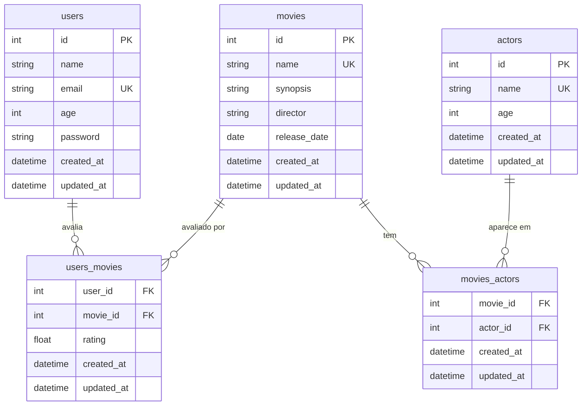

# Movie Rating API

Uma API REST para avaliação de filmes, construída com **FastAPI** e **SQLAlchemy assíncrono**.

## Tecnologias

| Camada | Tecnologia |
|---|---|
| Framework web | [FastAPI](https://fastapi.tiangolo.com/) |
| ORM | SQLAlchemy 2.x (async) |
| Banco de dados | PostgreSQL (produção) / SQLite em memória (testes) |
| Migrações | Alembic |
| Configurações | pydantic-settings |
| Hash de senha | pwdlib[argon2] |
| Autenticação | PyJWT (HS256) |
| Validação | Pydantic v2 |

## Modelo de dados

O diagrama abaixo mostra as cinco tabelas do banco e seus relacionamentos.

## Explore a documentação

- [Primeiros Passos](getting-started.md) — como rodar o projeto localmente
- [Arquitetura](architecture.md) — camadas, ciclo de vida de requisições e módulos core
- [Autenticação](authentication.md) — fluxo JWT e uso de tokens
- [Banco de Dados](database.md) — tabelas, constraints e regras de cascade
- [Referência da API](api-reference.md) — todos os endpoints com detalhes de request/response
